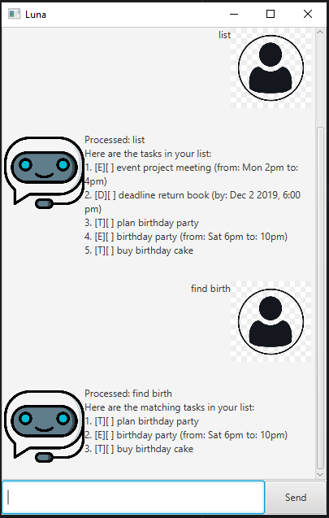

# Luna User Guide



## Introduction
Luna is your personal task management chatbot, designed to help you keep track of your to-dos, 
deadlines, and events with a simple and intuitive interface. Whether you're managing daily tasks 
or planning ahead, Luna ensures you stay organized effortlessly.

## Features

### Adding a To-Do Task
To add a simple to-do task:

Example: 'todo borrow book'

**Expected outcome:**
```
Processed: todo borrow book
Got it, I've added this task:
[T][ ] borrow book
```

### Adding a Deadline Task
To add a task with a deadline:

Example: 'deadline return book /by 24/02/2025 2359'

**Expected outcome:**
```
Processed: deadline return book /by 24/02/2025 2359
Got it, I've added this task:
[D][ ] return book (by: Feb 24 2025, 11:59 pm)
```

### Adding an Event Task
To add an event with a start and end time:

Example: 'event project meeting /from 24/02/2025 1500 /to 24/02/2025 1700'

**Expected outcome:**
```
Processed: event project meeting /from 24/02/2025 1500 /to 24/02/2025 1700
Got it, I've added this task:
[E][ ] project meeting (from: Feb 24 2025, 3:00 pm to: Feb 24 2025, 5:00 pm)
```

### Listing Tasks
To display all tasks currently in storage

Example: 'list'

**Expected outcome:**
```
Processed: list
Here are the tasks in your list:
1. [T][ ] borrow book
2. [D][ ] return book (by: Feb 24 2025, 11:59 pm)
3. [E][ ] project meeting (from: Feb 24 2025, 3:00 pm to: Feb 24 2025, 5:00 pm)
```

### Marking a Task as Complete
To mark a task as completed:

Example: 'mark 2'

**Expected outcome:**
```
Processed: mark 2
Nice! I've marked this task as done:
[D][X] return book (by: Feb 24 2025, 11:59 pm)
```

### Marking a Task as Incomplete
To undo completion of a task:

Example: 'unmark 2'

**Expected outcome:**
```
Processed: unmark 2
OK, I've marked this task as not done yet:
[D][ ] return book (by: Feb 24 2025, 11:59 pm)
```

### Finding a Task
To search for tasks by keyword:

Example: 'find book'

**Expected outcome:**
```
Processed: find book
Here are the matching tasks in your list:
1. [T][ ] borrow book
2. [D][ ] return book (by: Feb 24 2025, 11:59 pm)
```

### Deleting a Task
To delete a specific task:

Example: 'delete 1'

**Expected outcome:**
```
Processed: delete 1
Noted. I've removed this task:
[T][ ] borrow book
```